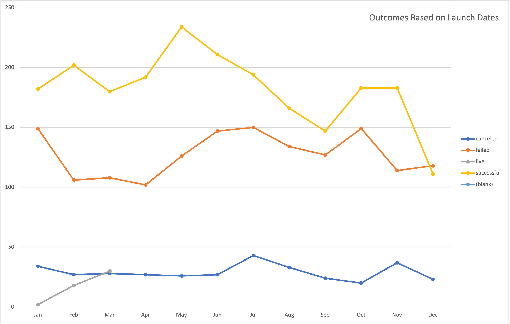
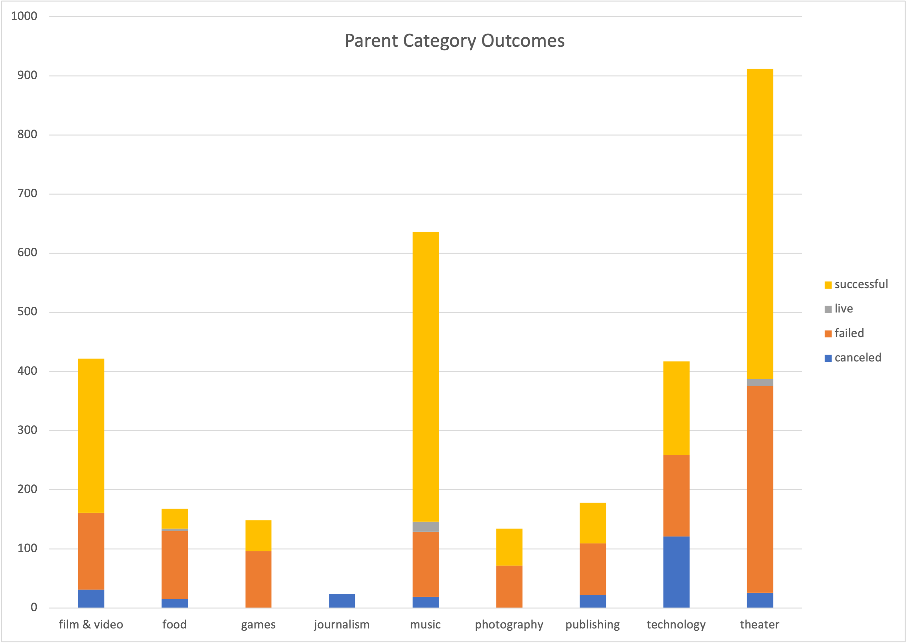
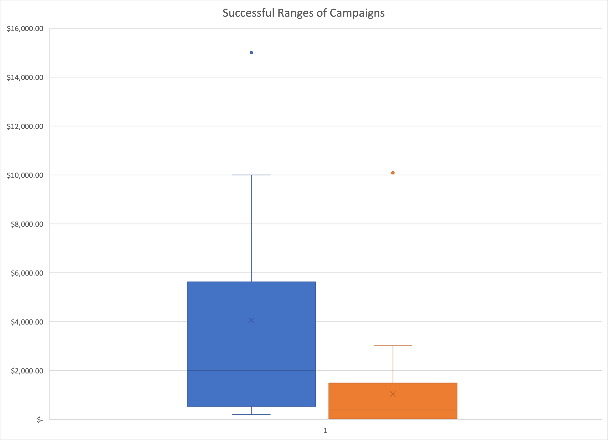

# **An Analysis of Kickstarter Campaigns**
Analysis of Kickstarter campaigns for best starting points to hit final goal.

This analysis included various performance types to determine the best initial criteria for a successful Kickstarter campaign.
Successful Kickstarter campaigns demonstrate three key components: start time, pledge amount, and type of performance. First, the timing. Successful Kickstarters began in mid to late spring, primarily most successful attempts began in May. While the goal amount of successful campaigns ranged from $1000 - $6000, further analysis revealed the average successful compaign reached a pledge amount around $1000. The highest amount recommended is around $1500. Finally, theatrical and music performance demonstrated the greatest success. With this in mind, the three key suggestions are a goal between $1000-1500, to launch the at the beginning of May, and to pursue a theatric or music type of performance. 

